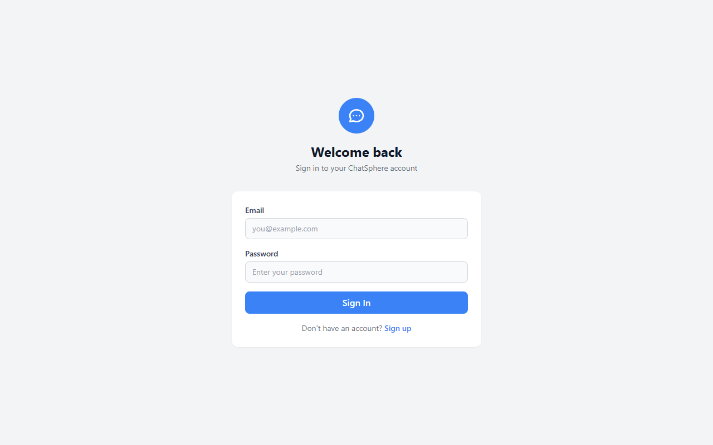
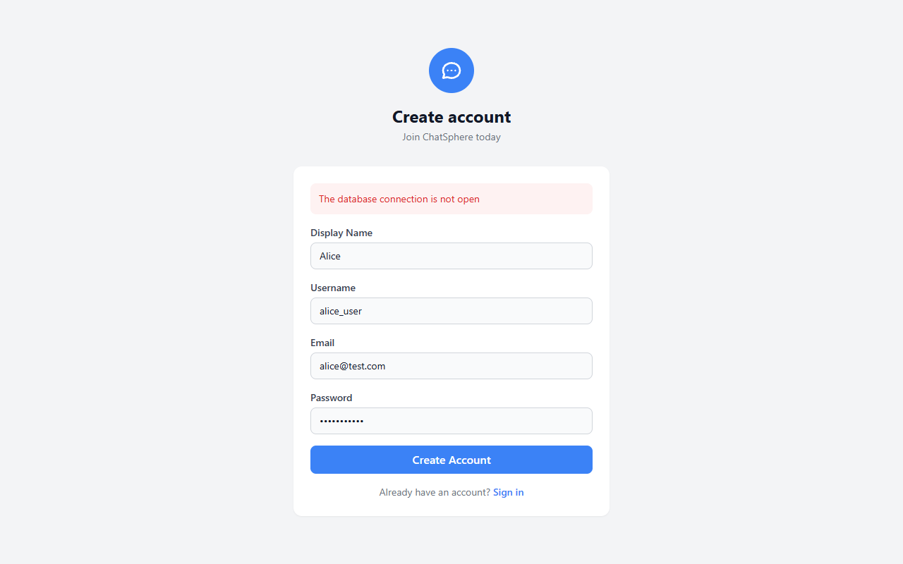
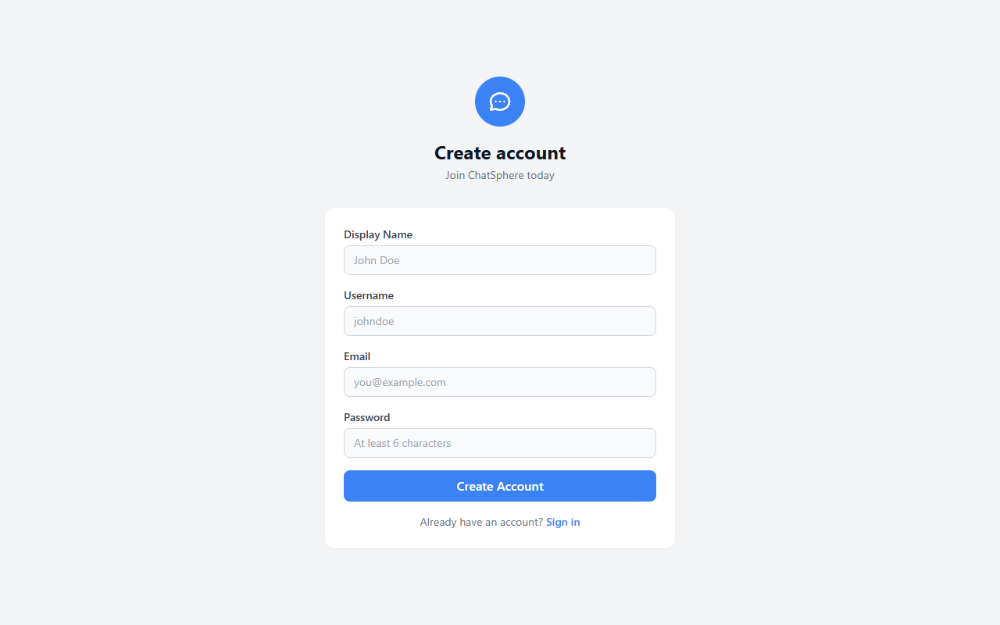
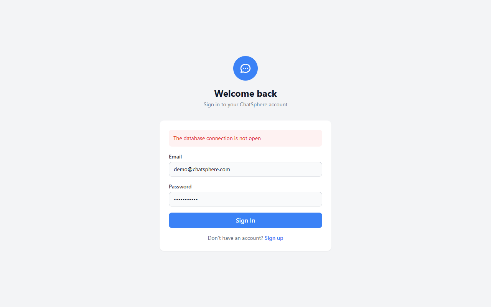

# ChatSphere

> A full-stack, real-time chat application with 1-on-1 messaging, group chats, media sharing, and online presence — deployable locally or on Vercel.




---

## Features

### Messaging
- **Real-time 1-on-1 Chat** — instant text delivery via Socket.IO
- **Group Chats** — create groups, add/remove members, admin roles
- **Typing Indicators** — see when others are typing (debounced)
- **Read Receipts** — single check (delivered) / double check (read)
- **Message Reply** — reply to specific messages with preview
- **Message History** — paginated with infinite scroll

### Media & File Sharing
- **Image Sharing** — inline preview with click-to-expand
- **Video Sharing** — inline player with controls
- **Audio / Voice Messages** — inline playback
- **Document Sharing** — PDF, text, ZIP, Word docs
- **File Uploads** — with progress indicator
- **Avatar Upload** — inline camera button in profile editor

### Online Presence
- **Real-time Status** — online/offline tracking via socket events
- **Green Dot Indicator** — on avatars for online users
- **Last Seen** — relative timestamps ("2m ago", "Yesterday")
- **Typing Indicators** — in both 1-on-1 and group chats

### User Management
- **Registration & Login** — email/password with bcrypt hashing
- **JWT Authentication** — persisted in localStorage
- **User Search** — find users by name, username, or email
- **Profile Management** — inline modal to update display name, bio, and avatar image
- **Protected Routes** — unauthenticated users redirected to login

### UI/UX
- **Responsive Design** — three-column desktop, mobile-friendly
- **Dark/Light Mode** — toggle button in sidebar, persists to localStorage, respects system preference, flash-free initialization
- **Toast Notifications** — success/error/info/warning (4s auto-dismiss)
- **Socket Error Handling** — connection errors surfaced to console
- **Error Boundary** — catches rendering crashes with "Try Again"
- **Loading States** — on all async actions
- **Empty States** — helpful messages when no conversations
- **Custom Scrollbar** — thin, rounded, cross-browser

### Security
- **Helmet** — HTTP header hardening
- **Rate Limiting** — 100 requests per 15 min per IP
- **Input Validation** — Zod schemas on all API routes
- **Password Hashing** — bcryptjs with 12-round salt
- **JWT** — signed with strong secret
- **File Validation** — whitelisted MIME types only
- **CORS** — restricted to configured origins

---

## Tech Stack

| Layer | Technology |
|-------|------------|
| **Frontend** | React 19, TypeScript, Vite, Tailwind CSS, Zustand, React Router 7, Socket.IO Client |
| **Backend** | Node.js, Express 5, TypeScript, Socket.IO 4, JWT, Bcrypt, Multer, Zod |
| **Database** | SQLite via `@libsql/client` (local dev) / Turso (Vercel production) |
| **Testing** | Jest + Supertest (backend), Vitest + React Testing Library (frontend) |
| **Deployment** | Vercel (fullstack), Turso (production database) |

---

## Screenshots

| | |
|---|---|
|  |  |
| Login page | Registration page |
|  |  |
| Empty state — no conversations | Active 1-on-1 chat |

---

## Project Structure

```
ChatSphere/
├─ api/                   # Vercel serverless entry point
├─ client/                # React frontend
│   ├─ src/
│   │   ├─ components/    # UI primitives (Avatar, MessageBubble, Sidebar, ProfileModal, etc.)
│   │   ├─ pages/         # Route pages (Login, Register, ChatView)
│   │   ├─ store/         # Zustand slices (auth, chats, users, toast, theme)
│   │   ├─ services/      # API wrappers (axios) & Socket.IO client
│   │   ├─ test/          # Vitest test files
│   │   └─ types/         # TypeScript interfaces
│   └─ vite.config.ts
├─ server/                # Express + Socket.IO backend
│   ├─ src/
│   │   ├─ controllers/   # Route handlers (auth, chat, group, user, file)
│   │   ├─ middleware/     # Auth JWT, validation, upload, error handler
│   │   ├─ models/        # Data access layer (User, Chat, Message, Group)
│   │   ├─ routes/        # Express routers
│   │   ├─ sockets/       # Socket.IO event handlers
│   │   └─ database.ts    # Schema init & connection (SQLite / Turso)
│   ├─ tests/             # Jest + Supertest integration tests
│   └─ uploads/           # Local file storage (gitignored)
├─ screenshots/           # App screenshots
├─ .env.example           # Environment variable template
├─ vercel.json            # Vercel deployment config
└─ package.json           # Root workspace
```

---

## Prerequisites

- **Node.js** v20 or later
- **npm** (comes with Node)
- **Git** (for cloning)

---

## Local Development

### 1. Clone & Install

```bash
git clone https://github.com/DharshanSP/ChatSphere.git
cd ChatSphere

# Server
cd server
cp ../.env.example .env   # edit JWT_SECRET
npm install
npm run dev               # starts on http://localhost:3001

# Client (separate terminal)
cd ../client
npm install
npm run dev               # starts on http://localhost:5173
```

### 2. Environment Variables

Copy `.env.example` to `server/.env` and configure:

| Variable | Default | Description |
|----------|---------|-------------|
| `JWT_SECRET` | — | Strong random key for signing tokens |
| `JWT_EXPIRES_IN` | `7d` | Token expiration duration |
| `PORT` | `3001` | Backend server port |
| `CORS_ORIGIN` | `http://localhost:5173` | Allowed frontend origin |
| `DATABASE_URL` | `file:chatsphere.db` | SQLite file (local) or Turso URL (production) |
| `DATABASE_AUTH_TOKEN` | — | Turso auth token (production only) |
| `UPLOAD_DIR` | `./uploads` | File upload directory |
| `MAX_FILE_SIZE` | `5242880` | Max upload size in bytes (5MB) |

### 3. Open the App

Navigate to **http://localhost:5173**, register a new user, and start chatting. Open a second browser window (or incognito) to register another user and see real-time messaging in action.

---

## Running Tests

```bash
# Backend tests (Jest + Supertest)
cd server
npm test

# Frontend tests (Vitest + React Testing Library)
cd client
npm test
```

---

## Railway Deployment

The backend can also be deployed on Railway (configured via `railway.toml`).

```bash
# Install Railway CLI
npm install -g @railway/cli

# Deploy
railway up
```

Set the following environment variables in the Railway dashboard:

| Variable | Value |
|----------|-------|
| `JWT_SECRET` | A strong random secret |
| `CORS_ORIGIN` | Your frontend URL |
| `DATABASE_URL` | `file:chatsphere.db` |
| `PORT` | `3001` |

---

## Vercel Deployment

This project is configured for fullstack deployment on Vercel.

### Deploy the Database (Turso)

ChatSphere uses `@libsql/client` which works with local SQLite files in development and Turso in production.

```bash
# Install Turso CLI
npm install -g turso

# Create a Turso database
turso db create chatsphere

# Get the database URL and auth token
turso db show chatsphere --url
turso db tokens create chatsphere
```

### Deploy to Vercel

```bash
# Install Vercel CLI
npm install -g vercel

# Deploy
vercel --prod
```

Set the following environment variables in the Vercel dashboard:

| Variable | Value |
|----------|-------|
| `DATABASE_URL` | `libsql://your-db.turso.io` |
| `DATABASE_AUTH_TOKEN` | Your Turso auth token |
| `JWT_SECRET` | A strong random secret |
| `JWT_EXPIRES_IN` | `7d` |
| `CORS_ORIGIN` | Your Vercel domain |

> **Note:** Socket.IO real-time features require WebSocket support, which is available on Vercel Pro/Enterprise plans. On the Hobby tier, the REST API endpoints work fully, but real-time messaging relies on HTTP polling (and is best used in local development).

---

## API Overview

| Method | Endpoint | Description |
|--------|----------|-------------|
| POST | `/api/auth/register` | Register a new user |
| POST | `/api/auth/login` | Login with email/password |
| GET | `/api/users` | List/search users |
| GET | `/api/users/online` | Get online users |
| GET | `/api/users/:id` | Get user by ID |
| PUT | `/api/users/profile` | Update profile |
| POST | `/api/chats` | Create 1-on-1 chat |
| GET | `/api/chats` | Get user chats |
| GET | `/api/chats/:id` | Get chat details |
| POST | `/api/chats/message` | Send message |
| GET | `/api/chats/:chatId/messages` | Get messages (paginated) |
| PUT | `/api/chats/read` | Mark messages as read |
| POST | `/api/groups` | Create group |
| GET | `/api/groups` | Get user groups |
| GET | `/api/groups/:id` | Get group details |
| PUT | `/api/groups/:id` | Update group (admin) |
| POST | `/api/groups/:id/members` | Add members (admin) |
| DELETE | `/api/groups/:id/members/:userId` | Remove member |
| POST | `/api/groups/message` | Send group message |
| GET | `/api/groups/:groupId/messages` | Get group messages |
| POST | `/api/files/upload` | Upload file |

---

## Database

ChatSphere uses **SQLite** locally (via `@libsql/client`) and **Turso** in production — a SQLite-compatible edge database.

**Tables:** `users`, `chats`, `chat_participants`, `messages`, `message_readBy`, `message_deliveredTo`, `groups`, `group_members`, `group_admins`

---

## License

This project is provided **as-is** for educational and personal use. Feel free to modify, extend, or redistribute under the terms of the MIT License.
